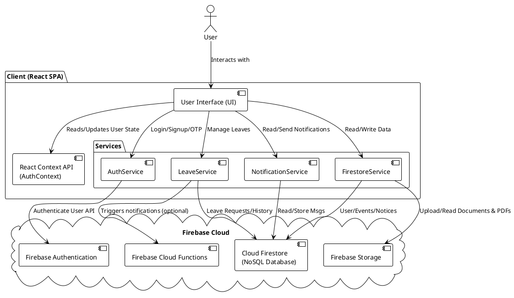

# System Architecture

The EduSync portal relies on a Serverless architecture largely backed by Firebase Services, heavily depending on Client-Side Rendering with React for its UI capabilities.

## High-Level Web Architecture

1. **Client Tier**: A React Single Page Application (SPA), styled with Tailwind CSS, acting as the primary interface for both Faculty and Admins.
2. **Service Tier**: Interacts with the backend via a standardized service layer (`src/services/*`), isolating pure Firebase calls from React Components.
3. **Data/Backend Tier**: Firebase provides real-time syncing capabilities, user authentication, data storage, and file persistence.

## PlantUML: Component Diagram

## Security & Principles
* **Role-Based Access Control (RBAC)**: Managed directly in the SPA using a `ProtectedRoute` component and validated using Firestore rules. Admins can see specific pages (`LeaveRequestsPage`, `AllTimetablesPage`) while faculty accounts are isolated to their own records.
* **Service Abstraction**: Direct API calls to Firebase are encapsulated in the `src/services/` layer (`authService.ts`, `leaveService.ts`), increasing testability and component cleanliness.
* **Component Modularity**: UI is built with ShadCN structural components (`src/components/ui/`) that are largely pure and configurable, composed heavily in Dashboard layouts (`src/components/dashboard/`).
