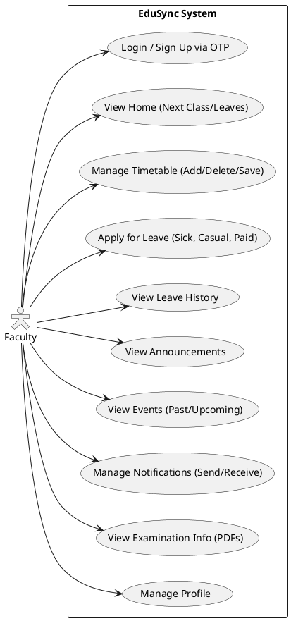
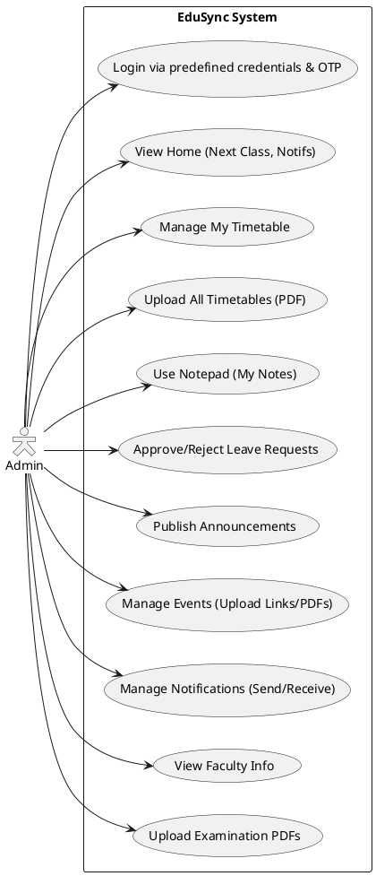

# Use Case Diagrams

The following Use Case diagrams outline the interactions between the primary actors (Admin and Faculty) and the EduSync system.

## Faculty Portal Use Case Diagram

## Admin Portal Use Case Diagram

