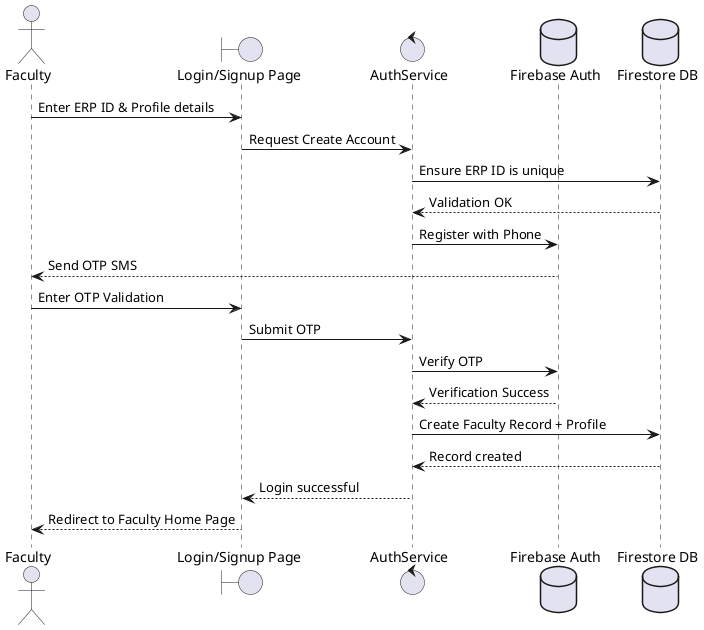
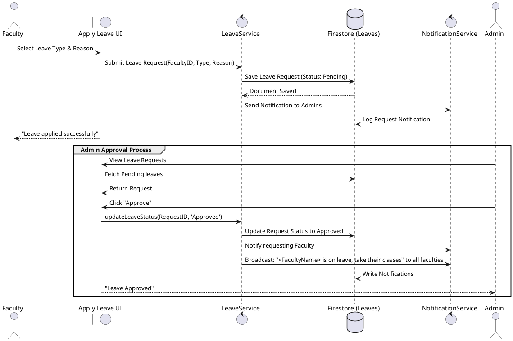
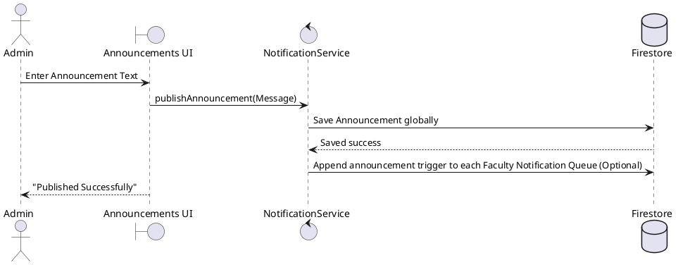

# Sequence Diagrams

These sequence diagrams capture the dynamic behavior and message flow across important system boundaries in EduSync.

## Authentication & OTP Login (Faculty)

## Leave Application Workflow

## Announcement Publication Workflow

