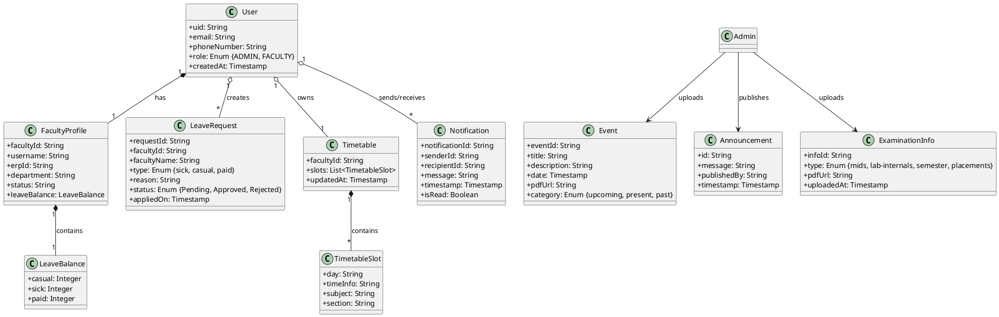

# Class Diagram

The following structural diagram presents the schema and relationships of the primary entities within the EduSync Firebase Database (Firestore).

## EduSync Entity Relationship (ER) & Class Diagram

